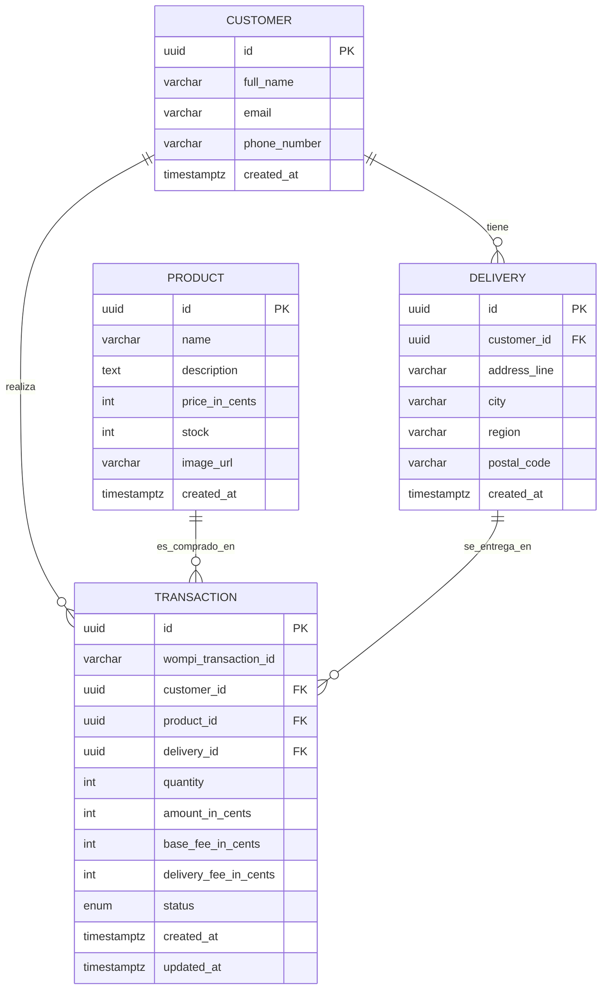

# Tienda Checkout — Fullstack

Aplicación web fullstack para la compra y pago de un producto a través de una pasarela de pagos (entorno Sandbox / UAT). Cubre todo el flujo de *onboarding* de compra: catálogo → datos de tarjeta y envío → resumen → procesamiento del pago → confirmación con actualización de inventario.

- **Backend:** NestJS + Arquitectura Hexagonal (Ports & Adapters) + Railway Oriented Programming (ROP) + PostgreSQL.
- **Frontend:** React + TypeScript + Redux Toolkit (Flux), mobile-first, resiliente a recargas.

Este repositorio contiene ambos proyectos. Cada uno tiene su propio README con detalle:

- [`backend/README.md`](./backend/README.md)
- [`frontend/README.md`](./frontend/README.md)

---

## Tabla de contenido

- [Arquitectura general](#arquitectura-general)
- [Modelo de datos](#modelo-de-datos)
- [Flujo de compra](#flujo-de-compra)
- [Estructura del repositorio](#estructura-del-repositorio)
- [Puesta en marcha local](#puesta-en-marcha-local)
- [Pruebas y cobertura](#pruebas-y-cobertura)
- [Documentación de la API](#documentación-de-la-api)
- [Seguridad](#seguridad)
- [Despliegue](#despliegue)

---

## Arquitectura general

```
┌──────────────────────────┐         ┌──────────────────────────────┐         ┌─────────────────┐
│  Frontend (React SPA)    │  HTTP   │  Backend (NestJS REST API)   │  HTTPS  │  Pasarela de     │
│  Redux Toolkit           │ ──────▶ │  Hexagonal + ROP             │ ──────▶ │  pagos (Sandbox) │
│  /api (proxy → backend)  │         │  /api                        │         │                 │
└──────────────────────────┘         └───────────────┬──────────────┘         └─────────────────┘
                                                      │ TypeORM
                                                      ▼
                                              ┌───────────────┐
                                              │  PostgreSQL   │
                                              └───────────────┘
```

El backend aísla el dominio de todo lo externo mediante **puertos** (interfaces) implementados por **adaptadores** (TypeORM, pasarela, config). Los casos de uso se expresan con **ROP**: cada operación devuelve un `Result<T, E>` y la primera falla corta la cadena sin lanzar excepciones.

El frontend implementa el flujo como una **máquina de estados** en Redux y persiste el progreso en `localStorage` (sin datos de tarjeta).

---

## Modelo de datos



`status` ∈ `{ PENDING, APPROVED, DECLINED, ERROR }`. Todos los montos se guardan en **centavos** (enteros) para evitar errores de redondeo.

---

## Flujo de compra (5 pasos)

1. **Catálogo** — producto, descripción, precio y stock disponible.
2. **Modal de pago y envío** — datos de tarjeta (validación Luhn + detección de franquicia Visa/MasterCard) y datos de cliente/entrega. Al confirmar, el backend crea una transacción `PENDING`.
3. **Resumen (backdrop)** — desglose: valor del producto + tarifa base + costo de envío.
4. **Procesamiento** — el backend obtiene el token de aceptación, tokeniza la tarjeta, firma la integridad (`SHA256`), crea la transacción en la pasarela y consulta su estado final. Si aprueba, descuenta stock.
5. **Resultado** — Aprobado / Rechazado / Error, y retorno al catálogo con el inventario actualizado.

---

## Estructura del repositorio

```
.
├── backend/            # API NestJS (hexagonal + ROP)
│   ├── src/
│   │   ├── domain/         # entidades, value objects, errores, Result (ROP), puertos
│   │   ├── application/    # casos de uso
│   │   ├── infrastructure/ # TypeORM, pasarela, adaptadores, config, seed
│   │   └── interfaces/http/# controllers, DTOs, presenters, filtro de errores
│   └── README.md
├── frontend/           # SPA React + Redux Toolkit
│   ├── src/
│   │   ├── domain/         # validaciones (Luhn, franquicia), formato de dinero
│   │   ├── api/            # cliente axios y servicios
│   │   ├── store/          # slices, persistencia localStorage
│   │   ├── components/     # UI reutilizable
│   │   └── screens/        # las 5 pantallas del flujo
│   └── README.md
└── README.md           # este archivo
```

---

## Puesta en marcha local

### Requisitos
- Node.js 20+
- PostgreSQL 14+

### 1. Backend

```bash
cd backend
npm install
cp .env.example .env         # ajusta credenciales de BD y de la pasarela
createdb checkout_db          # crea la base de datos
npm run seed                  # inserta productos de prueba
npm run start:dev             # http://localhost:3000/api
```

### 2. Frontend

```bash
cd frontend
npm install
npm run dev                   # http://localhost:5173  (proxy /api → :3000)
```

Abre **http://localhost:5173**. En el checkout puedes usar las tarjetas de prueba del Sandbox:

| Tarjeta | Resultado |
| :--- | :--- |
| `4242 4242 4242 4242` | Aprobada (APPROVED) |
| `4111 1111 1111 1111` | Rechazada (DECLINED) |

Cualquier fecha de expiración futura y CVC de 3 dígitos son válidos.

---

## Pruebas y cobertura

Ambos proyectos superan el mínimo del 80 % de cobertura exigido.

| Proyecto | Statements | Branches | Functions | Lines | Pruebas |
| :--- | :---: | :---: | :---: | :---: | :---: |
| Backend | 98.56 % | 85.61 % | 99.20 % | 98.58 % | 124 |
| Frontend | 97.84 % | 89.18 % | 96.66 % | 98.22 % | 91 |

```bash
# Backend
cd backend && npm run test:cov

# Frontend
cd frontend && npm run test:cov
```

---

## Documentación de la API

Con el backend corriendo:

- **Swagger UI:** http://localhost:3000/api/docs
- **OpenAPI JSON:** http://localhost:3000/api/docs-json (importable a Postman con *Import → Link*).

### Endpoints

| Método | Ruta | Descripción |
| :--- | :--- | :--- |
| `GET` | `/api/health` | Liveness probe |
| `GET` | `/api/products` | Lista de productos |
| `GET` | `/api/products/:id` | Detalle de un producto |
| `POST` | `/api/transactions` | Crea una transacción `PENDING` |
| `POST` | `/api/transactions/:id/pay` | Procesa el pago |
| `GET` | `/api/transactions/:id` | Estado de una transacción |

---

## Seguridad

- **Helmet** para cabeceras de seguridad (baseline OWASP) y **HTTPS** en producción.
- **Validación de entrada** con `class-validator`.
- Los **datos de tarjeta no se persisten** en base de datos ni en `localStorage`; solo se reenvían a la pasarela para su tokenización.
- **Firma de integridad** `SHA256` en la creación de la transacción.
- **CORS** restringido por lista de orígenes configurable.

---

## Despliegue

La aplicación se despliega tras **Nginx** como proxy inverso con SSL (Let's Encrypt):

- `/api/` → backend NestJS (`http://localhost:3000`)
- `/` → build estático del frontend

Pasos resumidos (VPS Ubuntu/Debian):

1. Clonar el repositorio e instalar dependencias en `backend/` y `frontend/`.
2. Configurar `backend/.env` (BD de producción y credenciales de la pasarela) y ejecutar migraciones/seed.
3. `npm run build` en el backend y arrancarlo con un gestor de procesos (PM2 o systemd).
4. `npm run build` en el frontend y servir `frontend/dist` desde Nginx.
5. Configurar Nginx con los mapeos anteriores y habilitar SSL con Certbot.

> El detalle paso a paso de la configuración de Nginx y el servicio se documentará en la fase de despliegue.
