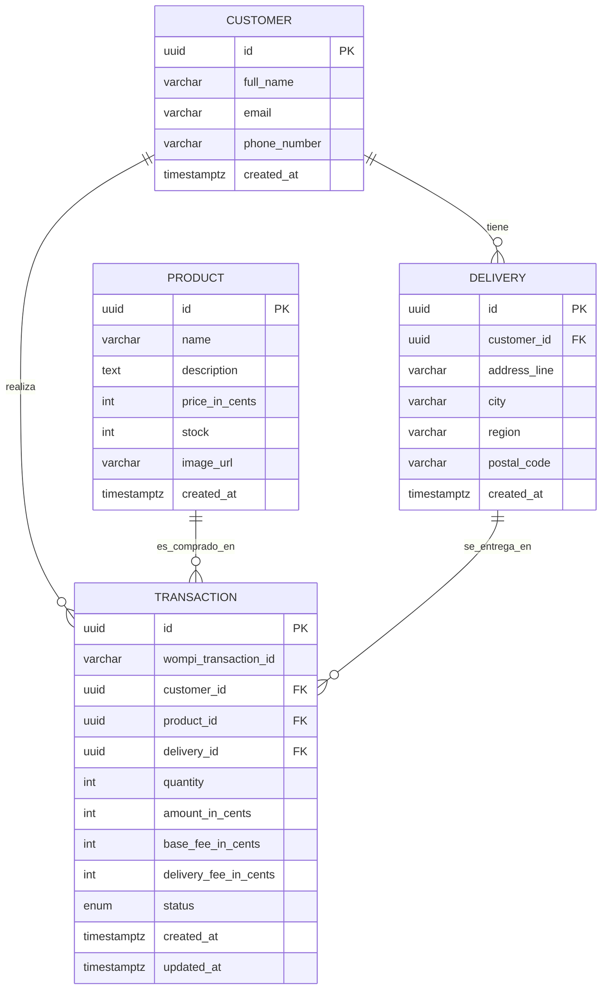

# Checkout API — Backend

API REST para el flujo de compra y pago de productos con integración a una pasarela de pagos en entorno Sandbox. Construida con **NestJS**, **Arquitectura Hexagonal (Ports & Adapters)** y **Railway Oriented Programming (ROP)**.

> Nota: el nombre del repositorio no incluye la marca de la pasarela, según lo solicitado en la prueba.

**En producción:** API en https://fullstackfecc.duckdns.org/api · Swagger en https://fullstackfecc.duckdns.org/api/docs

---

## Tabla de contenido

- [Stack](#stack)
- [Arquitectura](#arquitectura)
- [Modelo de datos](#modelo-de-datos)
- [Flujo de pago](#flujo-de-pago)
- [Puesta en marcha](#puesta-en-marcha)
- [Variables de entorno](#variables-de-entorno)
- [Endpoints de la API](#endpoints-de-la-api)
- [Documentación Swagger / Postman](#documentación-swagger--postman)
- [Pruebas y cobertura](#pruebas-y-cobertura)
- [Seguridad](#seguridad)

---

## Stack

| Capa | Tecnología |
| :--- | :--- |
| Framework | NestJS 10 (Node.js) |
| Lenguaje | TypeScript |
| Base de datos | PostgreSQL |
| ORM | TypeORM |
| HTTP client | Axios |
| Documentación | Swagger / OpenAPI |
| Pruebas | Jest |
| Seguridad | Helmet, validación con class-validator |

---

## Arquitectura

El proyecto sigue **Arquitectura Hexagonal**: el dominio y los casos de uso no conocen NestJS, TypeORM ni la pasarela. Todo lo externo se conecta a través de **puertos** (interfaces) implementados por **adaptadores** en la capa de infraestructura.

```
src/
├── domain/                     # Núcleo puro, sin dependencias de framework
│   ├── entities/               # Product, Customer, Delivery, Transaction
│   ├── value-objects/          # Money, Card (validación Luhn + franquicia)
│   ├── errors/                 # Errores tipados con código + status HTTP
│   ├── result/                 # Result<T,E> — primitiva de ROP
│   └── ports/                  # Interfaces: repositorios, gateway, id, fees
│
├── application/                # Casos de uso (orquestación en ROP)
│   └── use-cases/              # GetProducts, CreateTransaction, ProcessPayment...
│
├── infrastructure/             # Adaptadores (implementan los puertos)
│   ├── database/               # Entidades ORM, mappers, repositorios TypeORM, seed
│   ├── payment-gateway/        # Adaptador de la pasarela (Axios)
│   ├── adapters/               # UUID generator, proveedor de tarifas
│   └── config/                 # Validación de variables de entorno
│
└── interfaces/                 # Adaptadores de entrada
    └── http/                   # Controllers, DTOs, presenters, filtro de errores
```

### Railway Oriented Programming (ROP)

Cada caso de uso devuelve un `Result<T, E>` (`Ok` o `Err`). La primera falla corta el "riel" y se propaga sin lanzar excepciones. La capa HTTP traduce el `Err` de dominio a un status HTTP mediante `DomainExceptionFilter`.

```
loadTransaction → validateCard → charge → decrementStock → persist
      │               │            │            │             │
      └───────────────┴────────────┴────────────┴─────────────┘
                      cualquier Err corta y se retorna
```

---

## Modelo de datos



`status` es un enum: `PENDING | APPROVED | DECLINED | ERROR`.

---

## Flujo de pago

1. **Crear transacción** (`POST /api/transactions`): valida producto y stock, crea `Customer` + `Delivery` y una `Transaction` en estado `PENDING` con el desglose de montos (producto + tarifa base + envío). Aún **no** descuenta stock.
2. **Procesar pago** (`POST /api/transactions/:id/pay`):
   - Valida la tarjeta (Luhn, franquicia, expiración).
   - Llama a la pasarela: token de aceptación → tokenización de tarjeta → firma de integridad `SHA256(reference + amount + currency + secret)` → creación de la transacción → polling del estado final.
   - Si **APPROVED**: descuenta stock y marca `APPROVED`.
   - Si **DECLINED**: marca `DECLINED` (stock intacto).
   - Si falla la pasarela o el estado no es final: marca `ERROR`.
   - Es **idempotente**: una transacción ya finalizada se devuelve tal cual.
3. **Consultar** (`GET /api/transactions/:id`): estado actual de la transacción.

---

## Puesta en marcha

### Requisitos

- Node.js 20+
- PostgreSQL 14+

### Pasos

```bash
# 1. Instalar dependencias
npm install

# 2. Configurar entorno
cp .env.example .env
# edita .env con tus credenciales de base de datos y de la pasarela

# 3. Crear la base de datos en PostgreSQL
#    (el esquema se crea solo si DB_SYNCHRONIZE=true en desarrollo)
createdb checkout_db

# 4. Poblar productos de prueba
npm run seed

# 5. Levantar en desarrollo
npm run start:dev
```

La API queda disponible en `http://localhost:3000/api` y Swagger en `http://localhost:3000/api/docs`.

### Scripts

| Script | Descripción |
| :--- | :--- |
| `npm run start:dev` | Servidor en modo watch |
| `npm run build` | Compilación de producción |
| `npm run start:prod` | Ejecuta el build (`dist/main`) |
| `npm run seed` | Inserta los productos de prueba (idempotente) |
| `npm test` | Ejecuta las pruebas |
| `npm run test:cov` | Pruebas + reporte de cobertura |
| `npm run lint` | ESLint + Prettier |

---

## Variables de entorno

| Variable | Descripción | Por defecto |
| :--- | :--- | :--- |
| `PORT` | Puerto HTTP | `3000` |
| `CORS_ORIGINS` | Orígenes permitidos (separados por coma) | `*` |
| `DB_HOST` / `DB_PORT` | Host y puerto de PostgreSQL | `localhost` / `5432` |
| `DB_USERNAME` / `DB_PASSWORD` | Credenciales de la BD | `postgres` |
| `DB_NAME` | Nombre de la base de datos | `checkout_db` |
| `DB_SYNCHRONIZE` | Sincronizar esquema (solo dev) | `false` |
| `GATEWAY_BASE_URL` | URL base de la pasarela (Sandbox) | — |
| `GATEWAY_PUBLIC_KEY` | Llave pública | — |
| `GATEWAY_PRIVATE_KEY` | Llave privada | — |
| `GATEWAY_INTEGRITY_KEY` | Secreto de integridad para la firma | — |
| `BASE_FEE_IN_CENTS` | Tarifa base en centavos | `500000` |
| `DELIVERY_FEE_IN_CENTS` | Tarifa de envío en centavos | `1500000` |

---

## Endpoints de la API

Todas las rutas están bajo el prefijo `/api`.

| Método | Ruta | Descripción |
| :--- | :--- | :--- |
| `GET` | `/api/health` | Liveness probe |
| `GET` | `/api/products` | Lista de productos con stock |
| `GET` | `/api/products/:id` | Detalle de un producto |
| `POST` | `/api/transactions` | Crea una transacción `PENDING` |
| `POST` | `/api/transactions/:id/pay` | Procesa el pago con la pasarela |
| `GET` | `/api/transactions/:id` | Estado de una transacción |

### Ejemplo — crear transacción

```http
POST /api/transactions
Content-Type: application/json

{
  "productId": "11111111-1111-4111-8111-111111111111",
  "quantity": 1,
  "customer": {
    "fullName": "Juan Pérez",
    "email": "juan@example.com",
    "phoneNumber": "+573001112233"
  },
  "delivery": {
    "addressLine": "Calle 123 # 45-67",
    "city": "Bogotá",
    "region": "Cundinamarca",
    "postalCode": "110111"
  }
}
```

### Ejemplo — procesar pago

```http
POST /api/transactions/{id}/pay
Content-Type: application/json

{
  "card": {
    "number": "4242424242424242",
    "cvc": "123",
    "expMonth": "08",
    "expYear": "30",
    "cardHolder": "JUAN PEREZ"
  }
}
```

---

## Documentación Swagger / Postman

- **Swagger UI:** `http://localhost:3000/api/docs`
- **OpenAPI JSON:** `http://localhost:3000/api/docs-json` (exportable a Postman con *Import → Link*).

---

## Pruebas y cobertura

```bash
npm run test:cov
```

Resultado (Jest, 21 suites / 124 pruebas):

| Métrica | Cobertura |
| :--- | :---: |
| Statements | **98.56 %** |
| Branches | **85.61 %** |
| Functions | **99.20 %** |
| Lines | **98.58 %** |

Todas las métricas superan el mínimo requerido del 80 %. El reporte `lcov` se genera en `coverage/`.

Las pruebas cubren: primitiva ROP `Result`, value objects (`Money`, validación `Card`/Luhn), entidades de dominio, los cinco casos de uso (incluyendo caminos de error), el adaptador de la pasarela (con Axios mockeado), mappers, repositorios TypeORM, presenters, el filtro de excepciones y los controllers.

---

## Seguridad

- **Helmet** para cabeceras de seguridad (baseline OWASP).
- **Validación de entrada** con `class-validator` y `ValidationPipe` (`whitelist` + `forbidNonWhitelisted`).
- Los datos de tarjeta **no se persisten ni se exponen** en las respuestas; solo se reenvían a la pasarela para su tokenización.
- **CORS** restringido por lista de orígenes configurable.
- Firma de integridad `SHA256` en la creación de la transacción con la pasarela.
